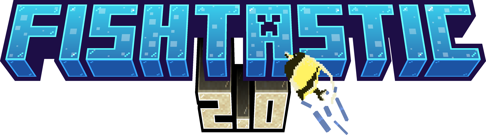

  

<h1>Fishtastic overhauls the fishing mechanics from vanilla Minecraft by adding a new fishing minigame. Catch over 50 new species of fish by fishing all over your world to complete the entire catalog. Catch fish and creatures of different sizes and rarity, then use the endlessly customizable Fish Tank block to show your haul to the world.</h1>
 
[Quick Start Guide>](https://github.com/CurrenJ/fishtastic/wiki/Getting-Started)
